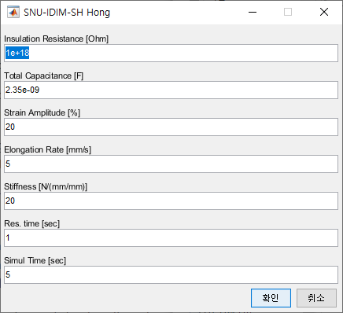
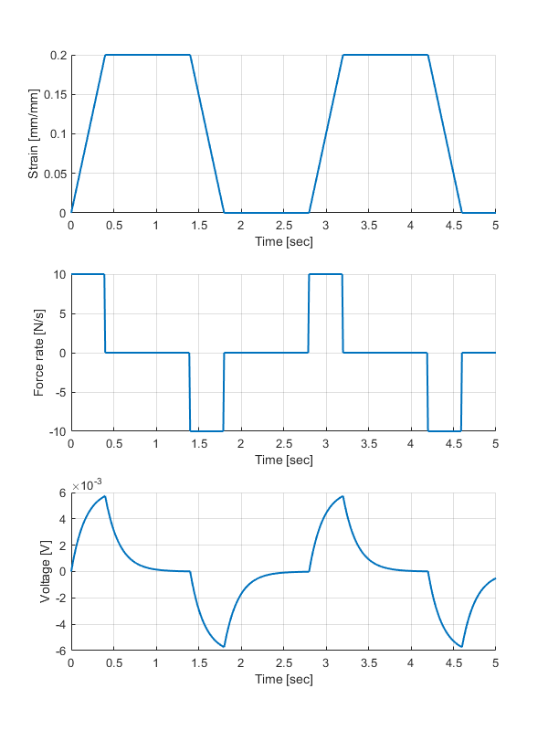
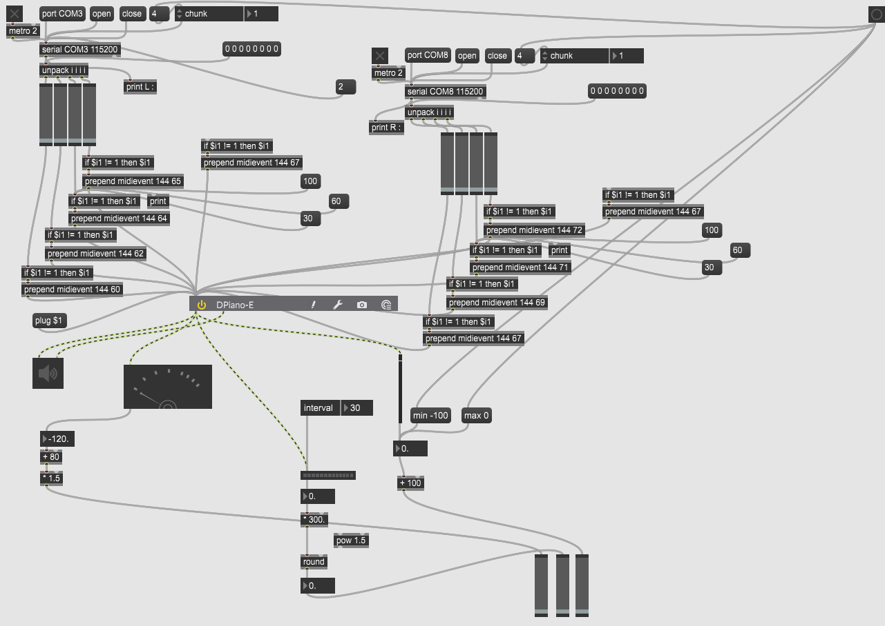

# SNU_kirigami

Software code repos. for the research on stretchable piezoelectric strain sensor with kirigami pattern.
## Matlab piezoelectric measurement simulator
#### Some results from this work was included in our presentation at International Conference on Advanced Electromaterials, Jeju, Korea, 2021

>Because piezoelectric generators(energy harvestor, sensors, etc.) contain its own resistance and capacitance,
>measured voltage is highly affected by the total resistance and capacitance of measurement circuit.

>Generally, voltmeters with low-price, high sample rate, high resolution tend to have low internal impedance, making them far from ideal voltmeter.
>(e.g. NI-USB6009, Arduino UNO ADC, etc.)

>This simulator will show how voltage profile differs depending on measurement devices(or circuits) with different specs.
>You can compare results of two cases below:
>>Case 1) R=144E3, C=350E-12: simulated _NI-USB6009(Low price)_ DAQ and our sensor(simplified).   
>>Case 2) R=1E15,  C=2350E-12: simulated _Keithley 6514(Excellent quality)_ electrometer and our sensor(simplified).   
>>Case 3) R=100E6, C=2350E-12: simulated some _mid-range voltmeters_ and our sensor.   

>Then, you may find that case 2) shows higher and steady voltage-time profile than others.   
<small>The default numerical solver option is _Implicit Runge-Kutta 4th order method(Gauss-Legendre quadrature)_</small>
</img>
<a href="/Matlab Simulation/PiezoSimul.m"></img></a>

## Measurement - Labview

>Environment: Labview 2015 and compatible version of NI MAX, NI VISA
>Information about H/W is available on <a href="https://www.nature.com/articles/s41528-022-00186-4#Sec10">paper</a> - Method

## Application Glove 

>Max 8: serial communication with PySerial via virtual COM port.   
>Python: Establish BLE connection with glove module and process data. Then, transmit processed signal to Max8.
>__Sorry for untidy python code. I'll fix it up soon.__
</img>

## More Information

#### More information about the research also can be found on my <a href="https://seongheonhong.github.io/index.html">website</a>.